# Conv2D AutoEncoderを用いた異常検出

Conv2Dを用いた異常検出を実験。   
mnistを使い0-4を正常値として学習し、5-9を異常値として検出したい。   

## 学習曲線

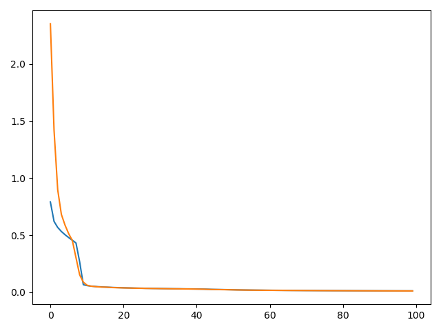


## 推論結果

| | origin | predict |
|:-----|:-----|:-----|
| 正常値 | 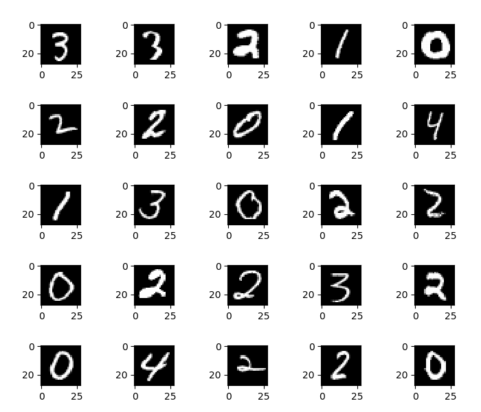 | 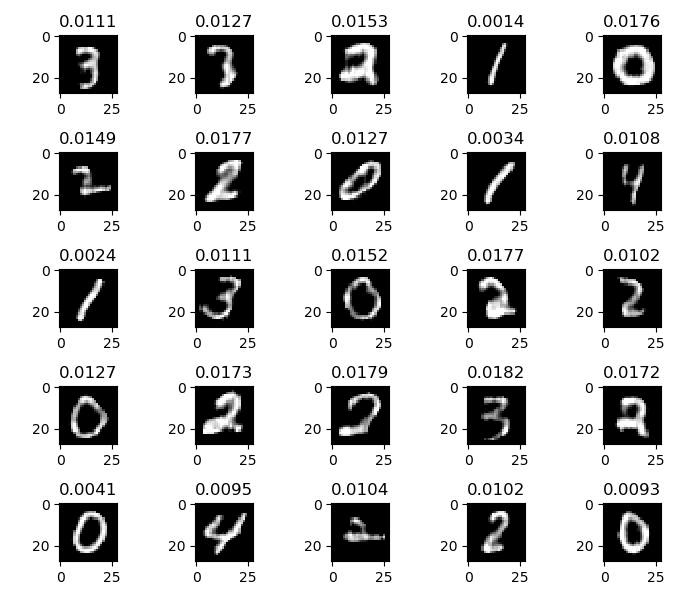 |
| 異常値 | 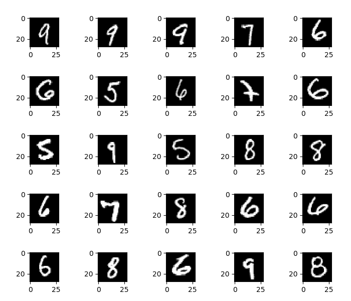 | 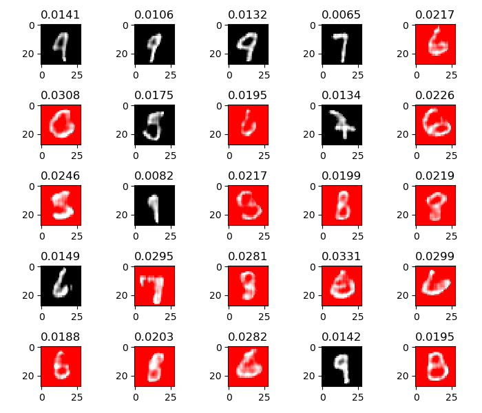 |
| 正常値 | 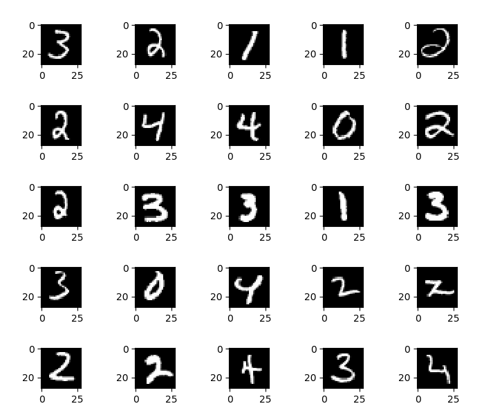 | 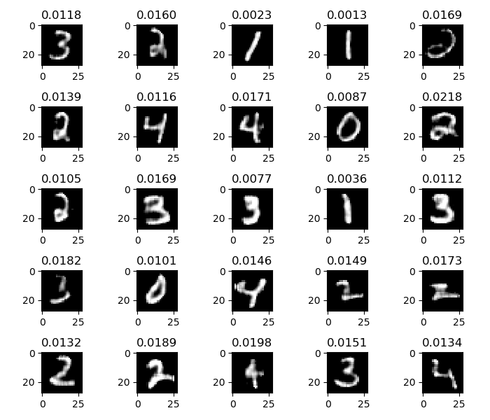 |
| 異常値| 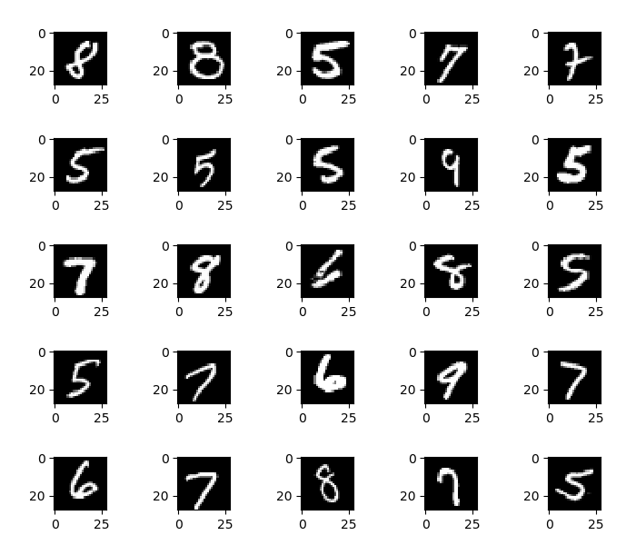 | 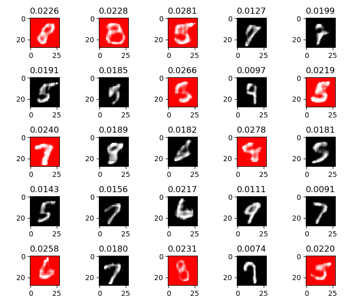 |
| 正常値 | 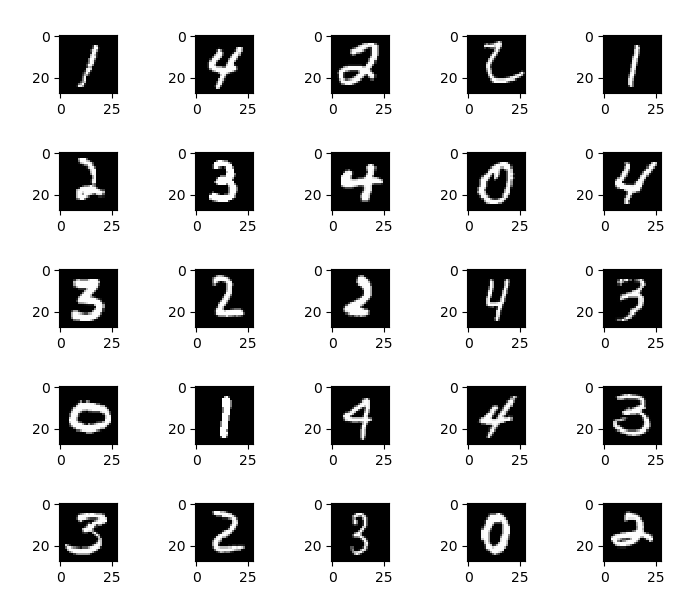 | 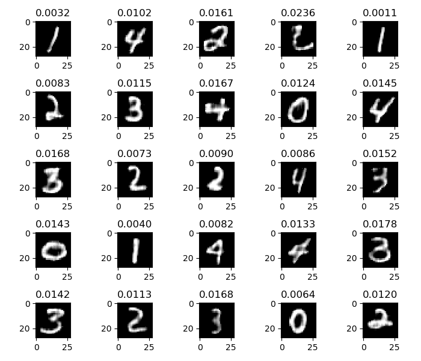 |
| 異常値| 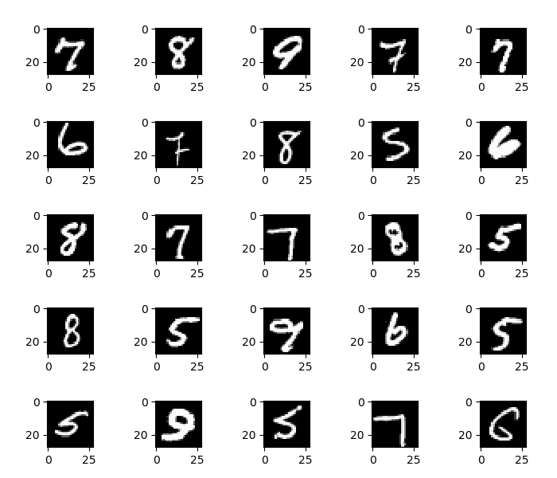 | 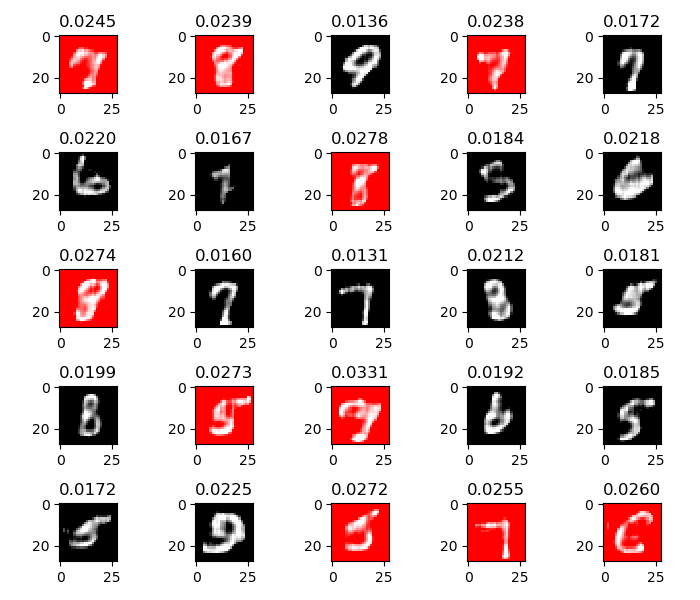 |


## レイヤー

```
_________________________________________________________________
Layer (type)                 Output Shape              Param #   
=================================================================
conv2d_1 (Conv2D)            (None, 28, 28, 32)        320       
_________________________________________________________________
max_pooling2d_1 (MaxPooling2 (None, 14, 14, 32)        0         
_________________________________________________________________
batch_normalization_1 (Batch (None, 14, 14, 32)        128       
_________________________________________________________________
conv2d_2 (Conv2D)            (None, 14, 14, 32)        9248      
_________________________________________________________________
max_pooling2d_2 (MaxPooling2 (None, 4, 4, 32)          0         
_________________________________________________________________
batch_normalization_2 (Batch (None, 4, 4, 32)          128       
_________________________________________________________________
conv2d_3 (Conv2D)            (None, 4, 4, 32)          9248      
_________________________________________________________________
up_sampling2d_1 (UpSampling2 (None, 16, 16, 32)        0         
_________________________________________________________________
batch_normalization_3 (Batch (None, 16, 16, 32)        128       
_________________________________________________________________
conv2d_4 (Conv2D)            (None, 14, 14, 32)        9248      
_________________________________________________________________
up_sampling2d_2 (UpSampling2 (None, 28, 28, 32)        0         
_________________________________________________________________
batch_normalization_4 (Batch (None, 28, 28, 32)        128       
_________________________________________________________________
conv2d_5 (Conv2D)            (None, 28, 28, 1)         289       
_________________________________________________________________
batch_normalization_5 (Batch (None, 28, 28, 1)         4         
_________________________________________________________________
conv2d_6 (Conv2D)            (None, 28, 28, 1)         10        
_________________________________________________________________
batch_normalization_6 (Batch (None, 28, 28, 1)         4         
_________________________________________________________________
conv2d_7 (Conv2D)            (None, 28, 28, 1)         10        
_________________________________________________________________
batch_normalization_7 (Batch (None, 28, 28, 1)         4         
=================================================================
```

## 解説
特徴量をUpSamplingした結果との平均二乗誤差を求め、閾値以上であれば異常とする   
閾値は正常値の最高値を使用した。   
実行結果は閾値を超えた値を赤く表示している。   

## 感想
閾値の求め方が悩みどころ。   
あとネットワークとハイパーパラメータももう少し最適化が必要な印象。